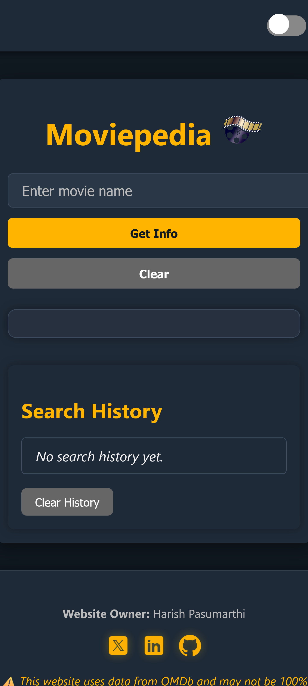
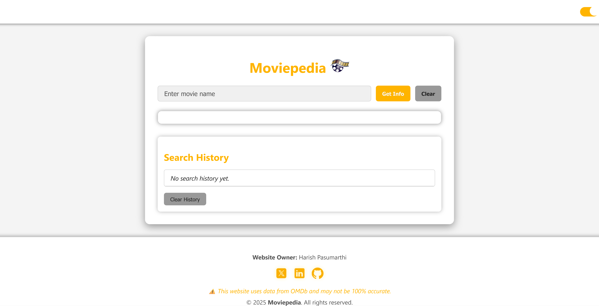
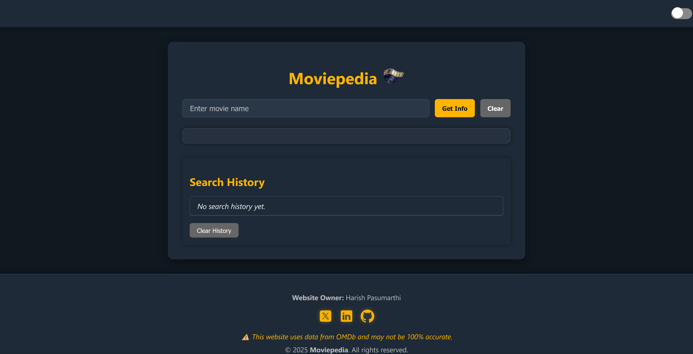

# 🎬 Moviepedia — Movie Search Web App

> A clean, responsive movie search experience powered by the OMDb API.

Moviepedia is a single-page web application that allows users to search for movie details in real-time. Featuring light/dark mode, search history, and a sleek, responsive design — it’s a small project with a big UI/UX focus.

---

## 📸 Screenshots

| Home Page | Light Mode | Dark Mode | Search History |
|-----------|------------|-----------|----------------|
|  |  |  |  |

> *Screenshots from desktop view. Mobile-responsive layout included.*

---

## 🚀 Features

- 🔍 **Real-Time Movie Search** – Powered by the [OMDb API](https://www.omdbapi.com/)
- 🌗 **Theme Toggle** – Light/Dark mode using CSS variables + JavaScript
- 🕓 **Persistent Search History** – Stored in browser via `localStorage`
- 📱 **Mobile-Responsive Layout** – Optimized for all screen sizes
- 🧩 **Modular Codebase** – Clean separation of logic for scalability
- ⚠️ **Error Handling** – User-friendly alerts for invalid or empty searches

---

## 🧠 What I Learned

- API integration & async JavaScript
- Managing state with localStorage
- Creating accessible, theme-aware UIs
- Structuring clean, modular vanilla JS projects

---

## 🛠 Tech Stack

- **HTML5** – Semantic markup
- **CSS3** – Variables, media queries, animations
- **JavaScript (ES6+)** – DOM manipulation, fetch API, modules
- **OMDb API** – Open Movie Database

---
